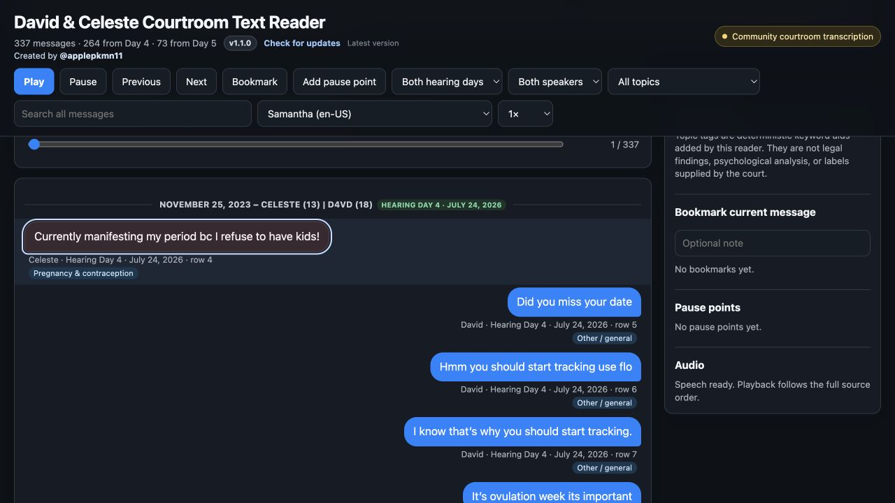
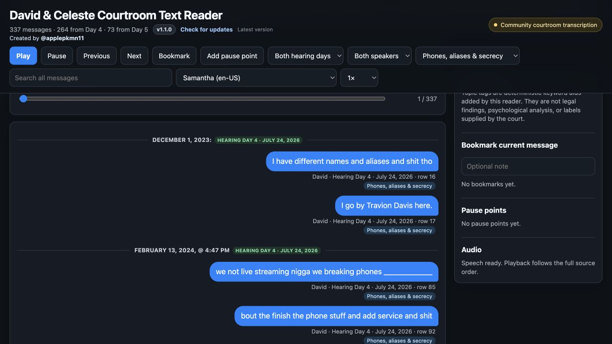
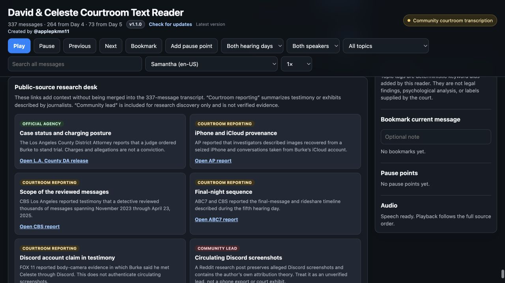

# David & Celeste Courtroom Text Reader

A searchable, filterable, bookmarkable, browser-based reader for the public
David Burke (D4vd) and Celeste Rivas Hernandez courtroom text-message
transcription.

Created and maintained by [@applepkmn11 on X](https://x.com/applepkmn11).
If you use this project in a YouTube video, podcast, article, or social post,
please credit the creator and link this project.

- **Use the online reader:**  
  https://appleforever11.github.io/david-celeste-courtroom-text-reader/
- **Download the newest offline ZIP:**  
  https://github.com/appleforever11/david-celeste-courtroom-text-reader/releases/latest

## What it includes

- 337 attributed entries across hearing Days 4 and 5
- Day and speaker filters
- Topic filters for the final night, pregnancy and contraception, threats and
  conflict, travel planning, phones and secrecy, and relationship context
- Full-text search
- Browser-based audio playback
- Local bookmarks and pause points
- Date dividers and source-row references
- A provenance-aware research desk that separates official-agency material,
  courtroom reporting, and unverified community leads
- A saved copy of the source workbook

## Important source warning

This is a community transcription reconstructed from courtroom notes and
published reporting. It is **not** the official forensic message export,
complete discovery, or an official court exhibit. The public source warns that
some material may be incomplete or inaccurate. Verify important claims against
official records and reputable reporting.

Content warning: the material discusses alleged child sexual abuse, pregnancy,
abortion, threats, and violence. The package contains no explicit photographs.

The reader and packaging were created with AI-assisted code. The message text
was imported from the cited public workbook; it was not generated or summarized
by AI.

## Open the offline reader

### macOS

1. Download the ZIP from the latest release.
2. Double-click the ZIP to extract it.
3. Open the extracted folder.
4. Double-click `david-celeste-imessage-player.html`.
5. If asked, choose Safari, Chrome, Firefox, or Edge.

### Windows

1. Download the ZIP from the latest release.
2. Right-click it and select **Extract All**.
3. Open the extracted folder.
4. Double-click `david-celeste-imessage-player.html`.
5. If asked, choose Edge, Chrome, or Firefox.

### Linux

1. Extract the ZIP.
2. Open the extracted folder.
3. Double-click `david-celeste-imessage-player.html`, or drag it into Firefox
   or Chrome.

Do not open the HTML file from inside the ZIP preview. Extract it first so
bookmarks, progress, and the saved-workbook link work correctly.

## Updates

The version badge inside the reader checks the latest GitHub release. The
online reader always tracks the newest published version. Offline users can
select **Check for updates** and download a newer ZIP when one is available.

## Sources

- [Public source spreadsheet](https://docs.google.com/spreadsheets/d/1WNubnsooEfODlmWnJmmN_CxVHYLsfvl_pRp7c-pOshw/edit?usp=sharing)
- [Associated Reddit post](https://www.reddit.com/r/d4vdiots/comments/1v8oy1d/d4vd_and_celestes_text_messages_from_prelim_day_4/)
- [Los Angeles County District Attorney case-status release](https://da.lacounty.gov/media/news/d4vd-ordered-stand-trial-murdering-dismembering-14-year-old-girl)
- [Associated Press courtroom report on the seized iPhone and iCloud conversations](https://apnews.com/article/d4vd-burke-celeste-rivas-hernandez-killing-hearing-6a1dd6c605e4551553daa8aa5f25fcad)
- [CBS Los Angeles report on the reviewed message range](https://www.cbsnews.com/losangeles/news/d4vd-murder-preliminary-hearing-day-5-celeste-rivas-hernandez/)
- [ABC7 report on the final-message sequence](https://abc7.com/post/d4vd-murder-case-final-texts-celeste-rivas-hernandez-singer-shown-court-during-day-5-hearing/19586305/)
- [FOX 11 report on the Discord statement described in testimony](https://www.foxla.com/news/d4vd-trial-preliminary-hearing-celeste-rivas-hernandezs-murder-case)

The reporting links add context and provenance; their prose is not merged into
the 337-message transcription. Community screenshots and theories remain
clearly labeled as unverified research leads.
